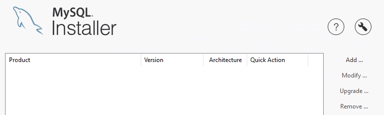
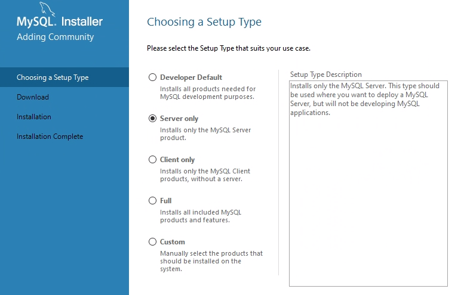
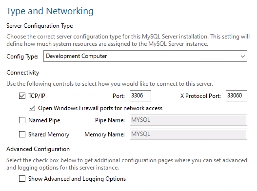
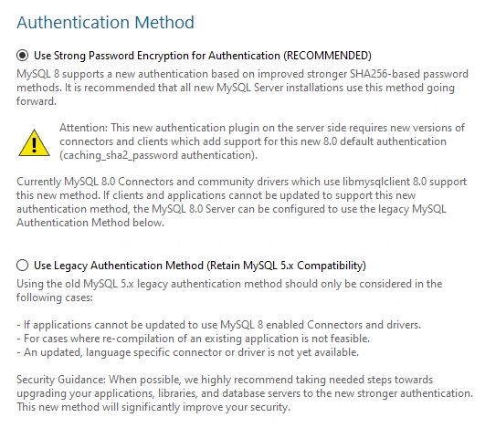
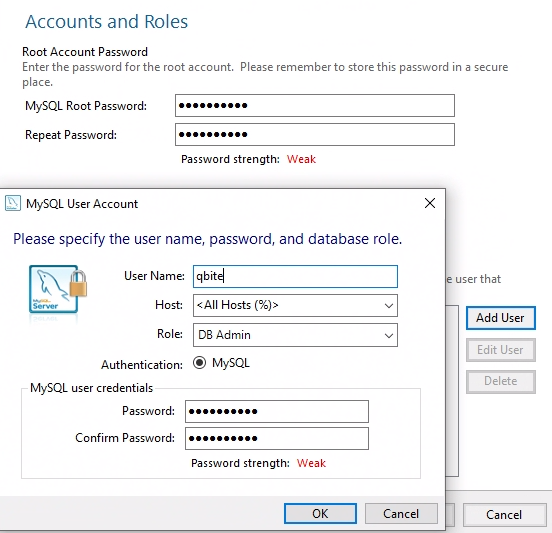
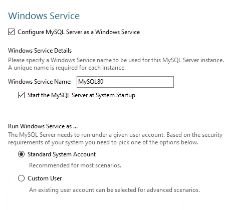
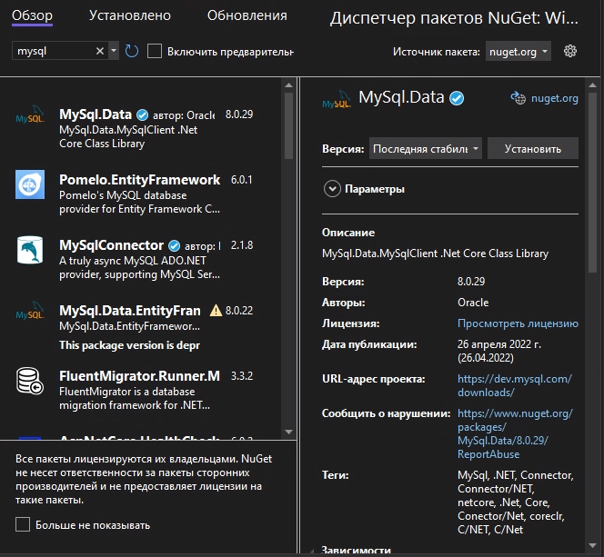
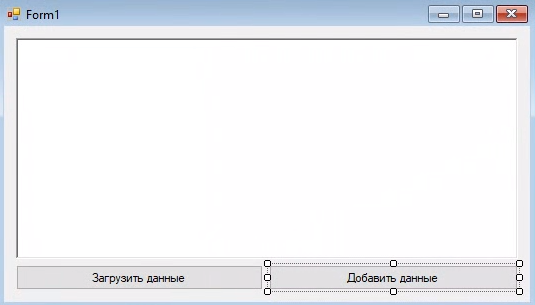
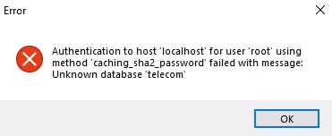
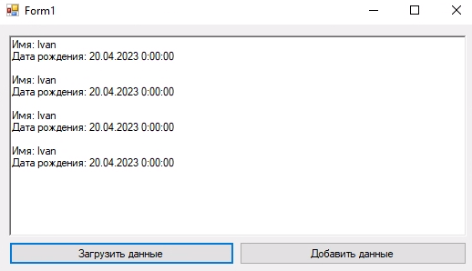

# Подготовка
## Установка и настройка MySQL сервера
### Установка сервера

Для начала работы нам потребуется MySQL Community server и .NET Connector. Чтобы не ставить и настраивать сервер можно воспользоваться [MySQL Installer'ом [Скачать]](https://dev.mysql.com/downloads/installer/). Зайдём в MySQL Installer и нажмём ``Add``.



В открывшемся окне выбираем тип установки ``Server Only``



На следующем этапе нас попросят подтвердить установку, нажимаем ``Execute``.

### Конфигурация БД
После установки бд программа предложит её настроить. В ``Types and Networking`` оставляем настройки как на скрине ниже:



На этапе ``Authentication Method`` ничего не меняем



Затем добавляем пользователей в бд и настраиваем пароль для ``root``.



Можно установить MySQL сервер как службу, в этом случае сервер сам будет запускаться при включении ОС:



## Настройка проекта
Создадим проект ``Приложение Windows Forms (.NET Framework)``. Зайдём во вкладку ``Проект > Управление пакетами NuGet`` и в поиск во вкладке ``Обзор`` напишем ``mysql``. В списке выбираем MySQL.Data и устанавливаем его:



# Подключение к бд
Перейдём на форму и добавим ``richTextBox`` для вывода данных, кнопку для добавления данных и кнопку доя загрузки данных из бд:



Добавим обработчик события на форму - ``onLoad`` и на две кнопки - ``onClick``. Напишем в onLoad строчки для подключения в бд:
```csharp
using MySql.Data.MySqlClient; // Для работы с MySQL
using System;
using System.Windows.Forms;

namespace WindowsFormsApp1 {
    public partial class Form1 : Form {
        // Создаём экземпляр соединения с бд
        private MySqlConnection connection = new MySqlConnection("server=localhost;user=root;database=telecom;port=3306;password=donthackme");
        
        public Form1() {
            InitializeComponent();
        }

        // Когда форма загрузилась
        private void Form1_Load(object sender, EventArgs e) {
            try {
                connection.Open(); // Открываем соединение
            } catch (Exception ex) {
                MessageBox.Show(ex.Message, "Error", MessageBoxButtons.OK, MessageBoxIcon.Error); // Вывод сообщения об ошибке
                Application.Exit(); // Выход из приложения
            }
        }

        // ...
    }
}
```

Запустим код и увидим ошбику из-за того, что база данных ``telecom``, к которой мы хотим подключиться, не существует:



Создадим эту базу данных и таблицу ``Clients`` в ней

```nocode
CREATE DATABASE telecom;

CREATE TABLE Clients (
    id INT NOT NULL PRIMARY KEY AUTO_INCREMENT,
    firstname VARCHAR(50),
    bday DATE
);
```

В кнопку которая добавляет записи напишем следующее:
```csharp
// Добавление данных в бд
private void button2_Click(object sender, EventArgs e) {
    MySqlCommand command = new MySqlCommand("INSERT INTO Clients(firstname, bday) VALUES(@firstname, @bday)", connection);

    // Параметры
    command.Parameters.AddWithValue("@firstname", "Ivan");
    command.Parameters.AddWithValue("@bday", "23.04.2004");

    command.ExecuteNonQuery();
}
```
> Примечание: очень важно при подстановке своих данных использовать параметры, а **НЕ** строку вида: ``$"INSERT INTO ... VALUES({firstname}, {bday})"``, т.к. такой метод не гарантирует безопасность от sql инъекций.

Для просмотра записей из таблицы:
```csharp
// Получение данных из бд
private void button1_Click(object sender, EventArgs e) {
    richTextBox1.Clear();
    MySqlCommand command = new MySqlCommand("SELECT firstname, bday FROM Clients", connection);

    using (MySqlDataReader reader = command.ExecuteReader()) {
        while (reader.Read()) {
            string firstname = reader.GetString(0); // В скобках указываем индекс поля
            DateTime bday = reader.GetDateTime(1);
            richTextBox1.Text += $"Имя: {firstname}\nДата рождения: {bday}\n\n";
        }
    }
}
```

Полный код:
```csharp
using MySql.Data.MySqlClient;
using System;
using System.Windows.Forms;

namespace WindowsFormsApp1 {
    public partial class Form1 : Form {
        // Создаём экземпляр соединения с бд
        private MySqlConnection connection = new MySqlConnection("server=localhost;user=root;database=telecom;port=3306;password=donthackme");
        public Form1() {
            InitializeComponent();
        }

        // Когда форма загрузилась
        private void Form1_Load(object sender, EventArgs e) {
            try {
                connection.Open(); // Открываем соединение
            } catch (Exception ex) {
                MessageBox.Show(ex.Message, "Error", MessageBoxButtons.OK, MessageBoxIcon.Error); // Вывод сообщения об ошибке
                Application.Exit(); // Выход из приложения
            }
        }

        // Получение данных из бд
        private void button1_Click(object sender, EventArgs e) {
            richTextBox1.Clear();
            MySqlCommand command = new MySqlCommand("SELECT firstname, bday FROM Clients", connection);

            using (MySqlDataReader reader = command.ExecuteReader()) {
                while (reader.Read()) {
                    string firstname = reader.GetString(0); // В скобках указываем индекс поля
                    DateTime bday = reader.GetDateTime(1);
                    richTextBox1.Text += $"Имя: {firstname}\nДата рождения: {bday}\n\n";
                }
            }
        }

        // Добавление данных в бд
        private void button2_Click(object sender, EventArgs e) {
            MySqlCommand command = new MySqlCommand("INSERT INTO Clients(firstname, bday) VALUES(@firstname, @bday)", connection);

            // Параметры
            command.Parameters.AddWithValue("@firstname", "Ivan");
            command.Parameters.AddWithValue("@bday", "23.04.2004");

            command.ExecuteNonQuery();
        }
    }
}
```

# Результат
