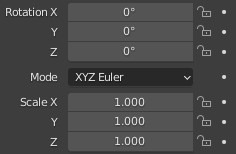
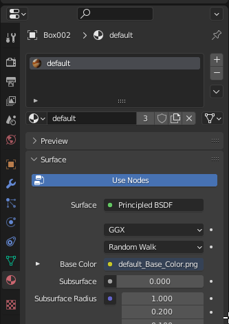
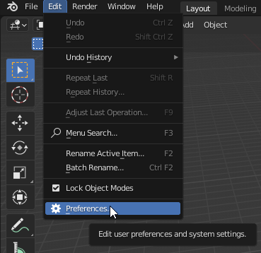
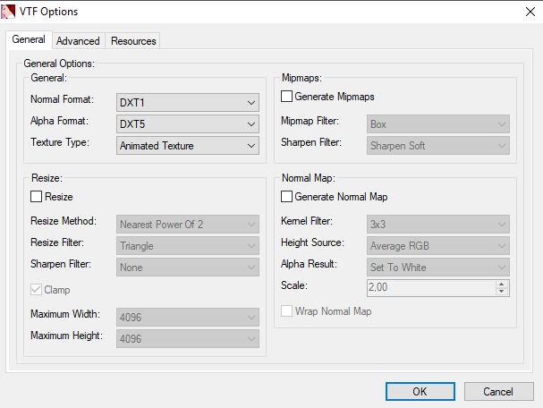

## Getting started
Create folder when be placed addon.

The addon structure will be as follows:
```bash
dog # addon root
├──materials # folder with materials and textures
│  └──dog # materials and textures for dog model
└──models # folder for models
   └──dog # dog model
```

## Useful tools for creating addons
#### Plugins for modelling programs
* [Blender source tools](http://steamreview.org/BlenderSourceTools/) - addon for Blender, which adds the ability to export model to ``.smd`` (Studiomdl Data) format.
#### Modding Tools
* [Crowbar](https://github.com/ZeqMacaw/Crowbar/releases/latest) - program, which allows to compile and decompile addon's model, and also create ``.gma`` files  and publish them to the steam workshop.
#### Program for editing textures and materials
* [VTFEdit](https://nemstools.github.io/pages/VTFLib-Download.html) - program for editing ``.vmt`` materials and ``.vtf`` textures.
* [VMTEditor](https://github.com/Dima-369/VMT-Editor/releases/latest) - program for editing ``.vmt`` materials

## 3D model editing
For this guide i'll use this model from sketchfab:

Delete collection ``Collection1`` and create new with ``dog`` title. Place imported ``1.fbx`` (``File > Import > FBX (.fbx)``) model to new collection.

Model need to be corrected, change its scale in ``Edit`` mode, selected all objects meshes, also make sure that ``scale`` = 1 and ``rotation`` on all axis = 0 in the ``Object Properties`` tab.

Next, let’s move to the workspace ``Shading``. Move ``default_Base_Color.png`` file to ``Shader Editor`` window and connect its parameter ``Color`` to ``Base color`` material. After that, see that now model has texture.

You should also pay attention to the name of the material. In my case, it’s ``default``. In the future we will use this name of material to create ``.vmt`` file at the [Textures and materials](#textures-and-materials) step.


### Model export
In order to compile the model into a readable view for the Source engine, you need to export the model to the ``.smd`` format. Exporting a model in the ``.smd`` format requires the presence of ``Blender source tools`` addon for Blender.

#### ``Blender source tools`` installing
Download [Blender source tools](http://steamreview.org/BlenderSourceTools/) **BUT don’t unzip it**, go to Blender and open the ``Edit > Preferences`` tab.

In ``Preferences`` window got to ``Addons`` tab and click on ``Install`` button, select ``blender_source_tools_<version>.zip``.

In the ``Community`` window enter in the search box ``source tools`` and enable it.


After installing of ``Blender source tools`` go to ``Scene Properties`` tab, and see that there’s a new ``Source Engine Export`` section. Enter ``Export Path`` - where will be saved model and ``Export Format`` - SMD. Click on ``Export`` button and select ``dog.smd`` that is collection, which we created on [model editing](#3d-model-editing) step.


## Model compiling
The model file obtained in the past step in the ``.smd`` format now need to be compiled to ``.mdl``. For this we need to download [Crowbar](https://github.com/ZeqMacaw/Crowbar/releases/latest). Create ``.qc`` file, which contains lines below, beside ``.smd`` model:
```php
$modelname "dog/dog.mdl" // Model path relatively from models/
$cdmaterials "dog" // folder thats contains materials relatively from materials/
// In general addons $cdmaterials starts from models/
$body "body" "dog.smd" // Model body
$sequence "idle" "dog.smd" // Model animation
```
This commands are required, more commands more commands can be found [here](https://developer.valvesoftware.com/wiki/Category:QC_Commands).

Open Crowbar, select ``Compiling`` tab. In ``QC Input`` enter path to ``.qc`` file. Output to - where will be saved final model. For me its ``Subfolder (of QC input)``. Click on ``Compile``.
> Note: When compiling model, you may see this error:
> ```log
> Crowbar ERROR: The model compiler, "C:\Program Files (x86)\Steam\steamapps\common\GarrysMod\bin\studiomdl.exe", does not exist.
> Possible causes: The game's SDK or Authoring Tools has not been installed (usually via Steam Library Tools) or the path given to Crowbar (via Set Up Games button) is incorrect.
> Crowbar ERROR: The game's "C:\Program Files (x86)\Steam\steamapps\common\GarrysMod\garrysmod\gameinfo.txt" file does not exist.
> Possible causes: The game's SDK or Authoring Tools has not been installed (usually via Steam Library Tools) or the path given to Crowbar (via Set Up Games button) is incorrect.
> ```
> This is because Garry's Mod don't located in default steam library folder. To solve this, you need to click on "Set Up Games" button and change path to your steam library folder (``<library1>``).
> 

## Textures and materials
Textures in Source engine stores in ``.vtf`` format, and materials in ``.vmt``. To convert ``.png`` textures to ``.vtf`` open [VTFEdit](https://nemstools.github.io/pages/VTFLib-Download.html), click on ``File > Import`` and select ``.png`` file. In open window nothing change and clcik ``OK``

After the texture opens in the preview window, click on ``Save As`` and save texture in ``/materials/dog/default_Base_Color.vtf``. Also create file ``dog.vmt`` and write into:
```php
// Comments need to be removed
VertexLitGeneric // One from available shaders
{
	$basetexture "dog/default_Base_Color" // Base texture
}
```
For more detailed and simple configuration of the model materials, you can use [VMTEditor](https://github.com/Dima-369/VMT-Editor/releases/latest), which allows not only to generate code and save material, but also to view the appearance of material when changed without running the game.

## Addon testing (result)
The addon folder needs to be moved to ``GarrysMod\garrysmod\addons``. Go to Garry's Mod, start singleplayer, search in props "dog" and spawn model.
