## Подготовка
Создаём папку в которой будет лежать наш аддон.

Структура аддона будет иметь следующий вид:
```bash
dog # корень аддона
├──materials # папка в которой хранятся материалы и текстуры
│  └──dog # материалы и текстуры для модели dog
└──models # папка в которой хранятся модели
   └──dog # модель dog
```

## Полезные инструменты для создания аддонов
#### Плагины для программ моделирования
* [Blender source tools [Скачать]](http://steamreview.org/BlenderSourceTools/) - аддон для Blender, который добавляет возможность экспортировать модель в формат ``.smd`` (Studiomdl Data).
#### Утилиты для моддинга
* [Crowbar [Скачать]](https://github.com/ZeqMacaw/Crowbar/releases/latest) - программа, которая позволяет компилировать и декомпилировать модели аддонов, а также создавать ``.gma`` файлы и опубликовывать их в workshop.
#### Программы для редактирования текстур и материалов
* [VTFEdit [Скачать]](https://nemstools.github.io/pages/VTFLib-Download.html) - программа для редактирования ``.vmt`` материалов и ``.vtf`` текстур.
* [VMTEditor [Скачать]](https://github.com/Dima-369/VMT-Editor/releases/latest) - программа для редактирования ``.vmt`` материалов

## Редактирование 3D модели
Для этого гайда я буду использовать вот эту модель со sketchfab:



Удалим коллекцию ``Collection1`` и создадим новую с названием ``dog``. Поместим внутрь новой коллекции импортированную модель ``1.fbx`` (пункт File > Import > FBX (.fbx)).

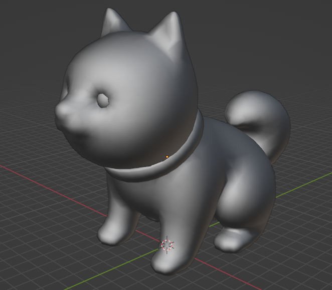

Модель нужно подправить, увеличив её размер в ``Edit`` режиме, выделив все сетки объектов, также убедитесь, что во вкладке ``Object Properties`` параметры ``scale`` = 1 и ``rotation`` по всем осям = 0.

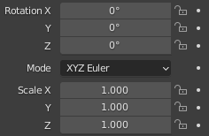

Далее перейдём в рабочую область ``Shading``. В окно ``Shader Editor`` перетащим файл ``default_Base_Color.png`` и подключим его параметр ``Color`` к параметру ``Base color`` на материале. После всех этих действий увидим, что теперь на модели есть текстура.

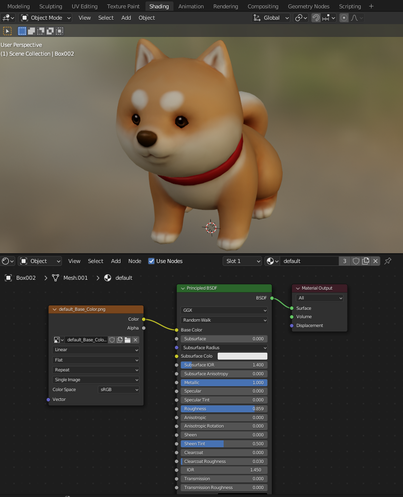

Также необходимо обратить внимание на название материала. В моём случае это ``default``. В дальнейшем нам пригодится это название материала для создания .vmt файла на этапе [Текстуры и материалы](#текстуры-и-материалы).

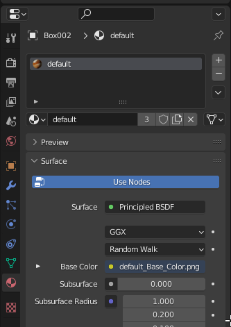

### Экспорт модели
Для того чтобы скомпилировать модель в читаемый для движка Source вид, необходимо экспортировать модель в формат ``.smd``. Экспорт модели в формате ``.smd`` требует наличия ``Blender source tools`` аддона для Blender.

#### Установка ``Blender source tools``
Скачиваем [Blender source tools [Скачать]](http://steamreview.org/BlenderSourceTools/) **НО не разархивируем его**, переходим в Blender и открываем вкладку ``Edit > Preferences``.

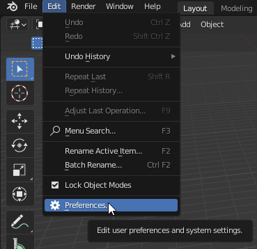

В открывшемся окне ``Preferences`` переходим во вкладку ``Addons`` и нажимаем на кнопку ``Install``, выбираем ``blender_source_tools_<версия>.zip``.

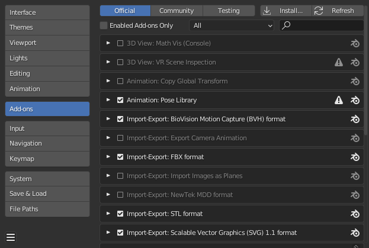

В окне ``Community`` вводим в поисковую строку ``source tools`` и включаем их.

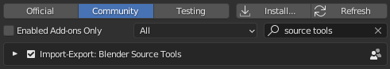

После установки ``Blender source tools`` перейдём в ``Scene Properties`` и увидим что появилась секция ``Source Engine Export``. Укажем ``Export Path`` - куда будет сохранена модель и ``Export Format`` - SMD. Нажмём кнопку ``Export`` и выберем ``dog.smd`` т.е. коллекцию, которую мы создали на этапе [редактирования модели](#редактирование-3d-модели).

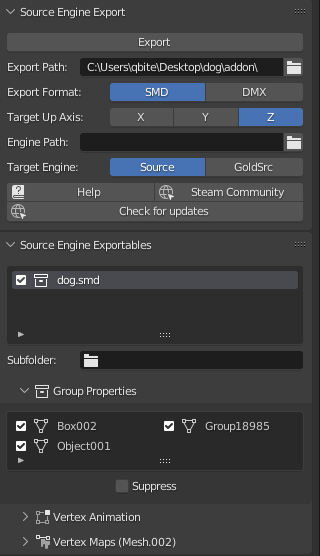

## Комплирование модели
Полученный на прошлом этапе файл модели в формате ``.smd`` теперь нужно скомпилировать в ``.mdl``. Для этого понадобится программа [Crowbar [Скачать]](https://github.com/ZeqMacaw/Crowbar/releases/latest). Создадим рядом с ``.smd`` моделью файл с расширением ``.qc`` в котором напишем следующие строчки:
```php
$modelname "dog/dog.mdl" // Путь до модели относительно папки models/ в корне аддона
$cdmaterials "dog" // Папка в которой хранятся материалы для модели относительно папки materials/ в корне аддона
// В большенстве аддонов $cdmaterials начинается с models/ для того, чтобы обозначить материал для модели
$body "body" "dog.smd" // Тело модели
$sequence "idle" "dog.smd" // Анимация модели
```
Данные команды являются обязательными, больше команд можно найти [здесь](https://developer.valvesoftware.com/wiki/Category:QC_Commands).

Откроем Crowbar в котором по умолчанию будет открыта вкладка ``Compiling``. В ``QC Input`` указываем созданный до этого ``.qc`` файл. Output to - куда будет сохранена итоговая модель. У меня это ``Subfolder (of QC input)``. Нажимаем ``Compile``.
> Примечание: При компиляции модели может возникнуть ошибка такого вида:
> ```log
> Crowbar ERROR: The model compiler, "C:\Program Files (x86)\Steam\steamapps\common\GarrysMod\bin\studiomdl.exe", does not exist.
> Possible causes: The game's SDK or Authoring Tools has not been installed (usually via Steam Library Tools) or the path given to Crowbar (via Set Up Games button) is incorrect.
> Crowbar ERROR: The game's "C:\Program Files (x86)\Steam\steamapps\common\GarrysMod\garrysmod\gameinfo.txt" file does not exist.
> Possible causes: The game's SDK or Authoring Tools has not been installed (usually via Steam Library Tools) or the path given to Crowbar (via Set Up Games button) is incorrect.
> ```
> То скорее всего расположения папки Garry's Mod не является стандартным. Для того чтобы исправить это, нужно нажать на кнопку "Set Up Games" и изменить путь до библиотеки (``<library1>``).
> 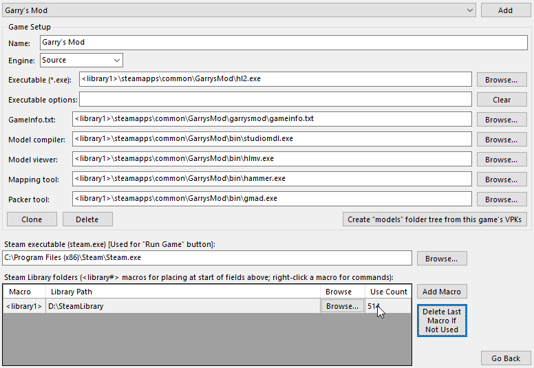

## Текстуры и материалы
Текстуры в движке source хранятся в формате ``.vtf``, а материалы в ``.vmt``. Для того чтобы конвертировать текстуры из ``.png`` в ``.vtf`` открываем [VTFEdit [Скачать]](https://nemstools.github.io/pages/VTFLib-Download.html) и в ``File > Import`` выбираем ``.png`` файл. В открывшемся окне ничего не меняем и нажимаем ``OK``

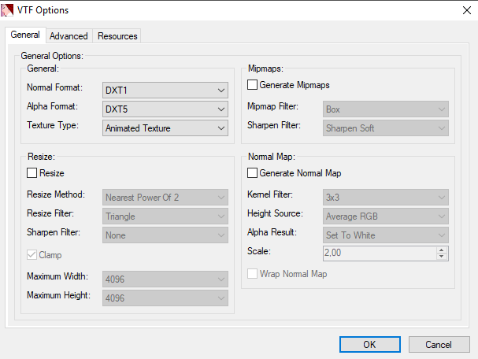

После того как текстура открылась в окне предпросмотра нажимаем ``Save As`` и сохраняем текстуру в папке ``/materials/dog/default_Base_Color.vtf``. Также создадим файл ``dog.vmt`` в котором напишем:
```php
// Комментарии лучше стереть
VertexLitGeneric // Один из доступных шейдеров
{
	$basetexture "dog/default_Base_Color" // Основная текстура
}
```
Для более подробной и простой настройки материалов модели можно воспользоваться программой [VMTEditor [Скачать]](https://github.com/Dima-369/VMT-Editor/releases/latest), которая позволяет не только сгенерировать код и сохранить материал, но также просматривать внешний вид материала при изменении не запуская игру.

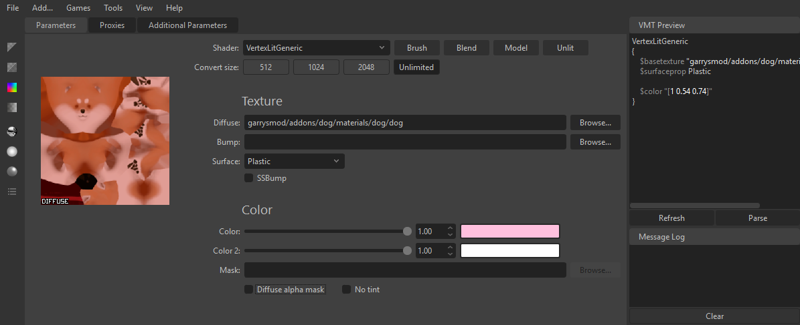

## Тестирование  аддона (результат)
Папку с аддоном нужно переместить в ``GarrysMod\garrysmod\addons``. Заходим в Garry's Mod, заупускаем одиночную игру, пишем в списке пропов "dog" и спавним модельку.

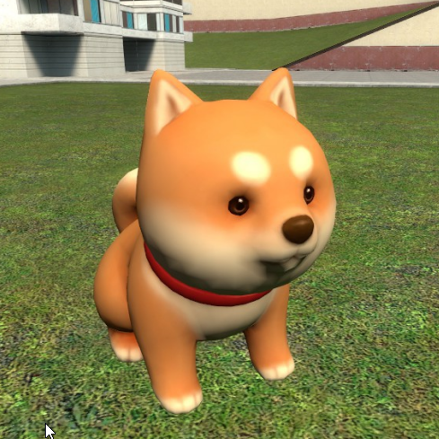
