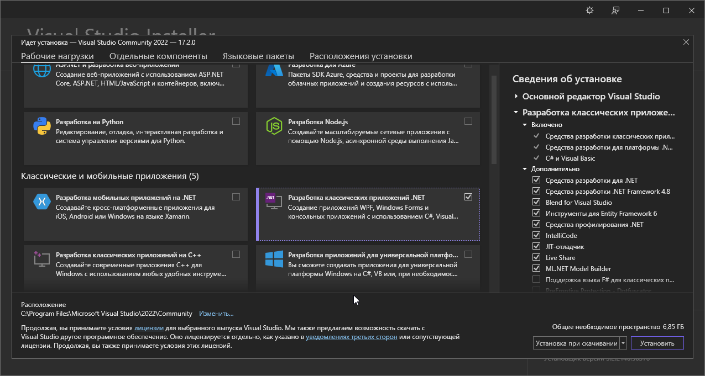
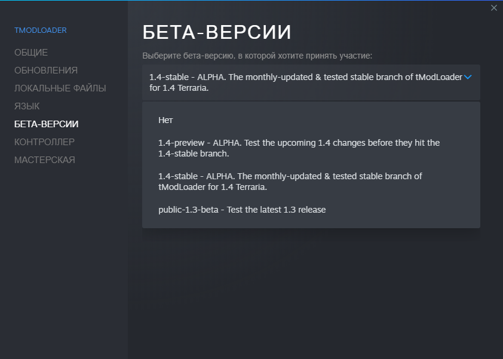
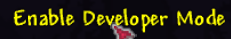
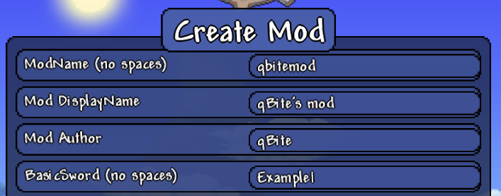
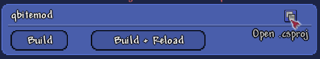
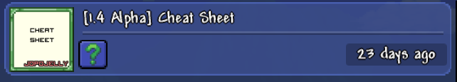

## Подготовка
### Visual Studio Installer
Для начала скачиваем [Visual Studio 2022 [Скачать]](https://visualstudio.microsoft.com/ru/downloads/).

> Примечание: выбрать нужно имеено последнюю Visual Studio 2022 т.к tModLoader для Terraria v1.4 работает с пакетом .NET Framework 4.8.

Открываем установщик и выбираем пункт ``Разработка классических приложений .NET``:

### tModLoader
Также зайдём в Steam и добавим себе tModLoader:



Зайдём в свойства tModLoader'а и выберем ``1.4-stable - ALPHA. Testing monthly-updated & tested stable branch of tModLoader for 1.4 Terraria``.

После этого зайдём в tModLoader, включим режим разработчика нажав на ``Enable developer mode``

После включения перейдём в Mod sources, создадим мод нажав на ``Create mod`` и введя данные:

## Разработка

Чтобы изменить код, мода нажмём на open .csproj, после измененией нужно нажать на ``Build + Reload``:

## Тестирование

Для тестирования мода лучше скачать себе мод ``Cheet Sheet``, с помощью которого можно выдавать себе предметы:

